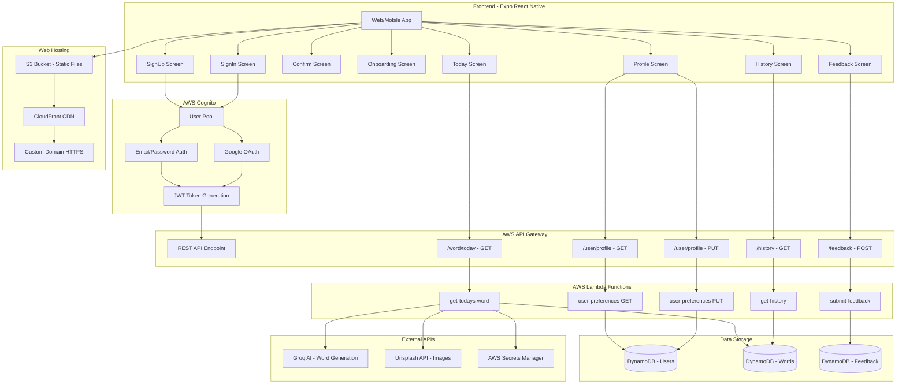
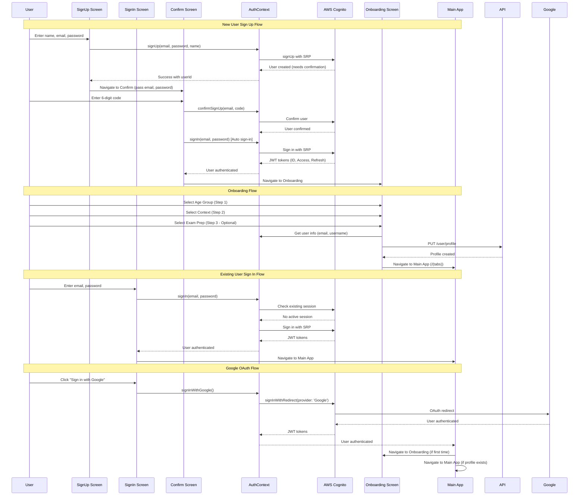
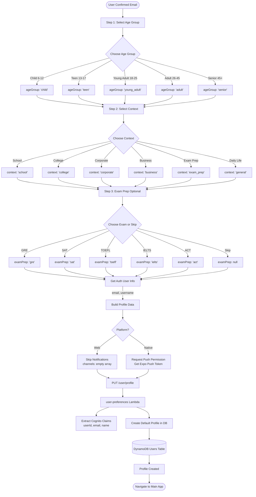
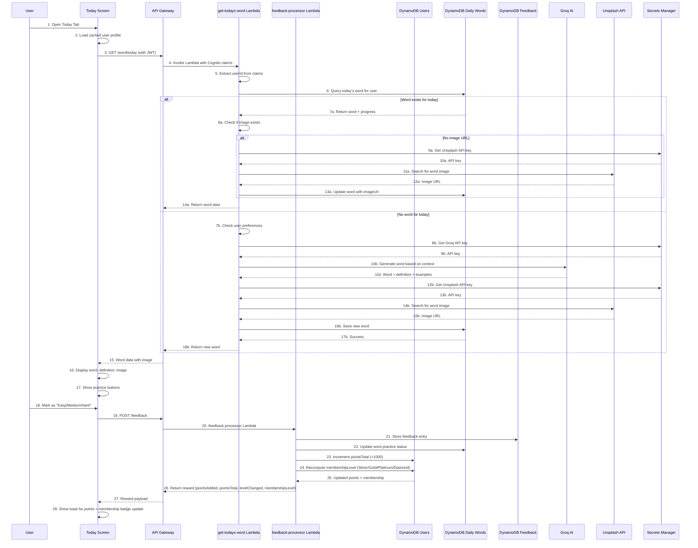
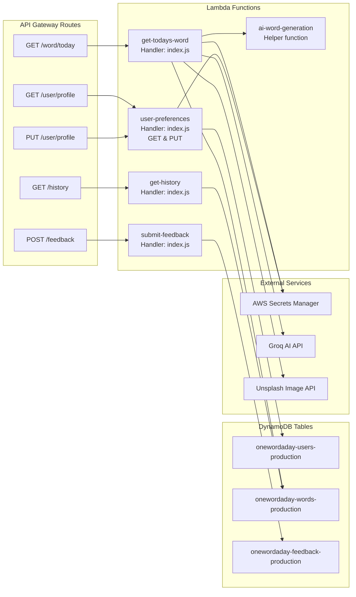
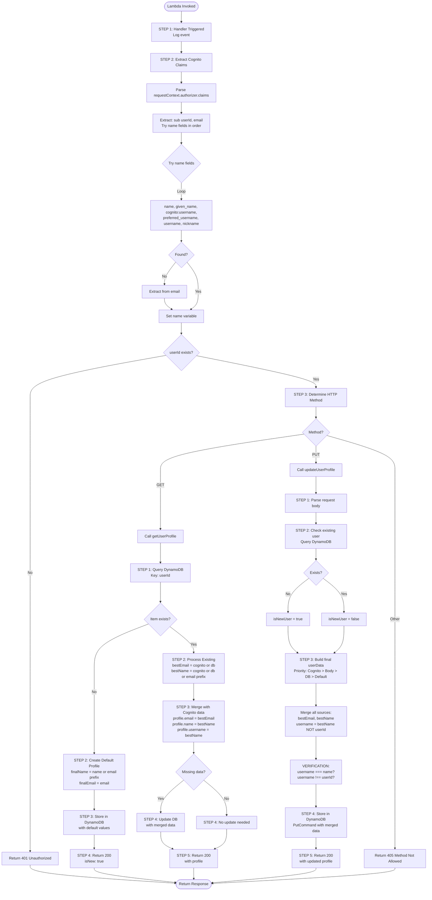
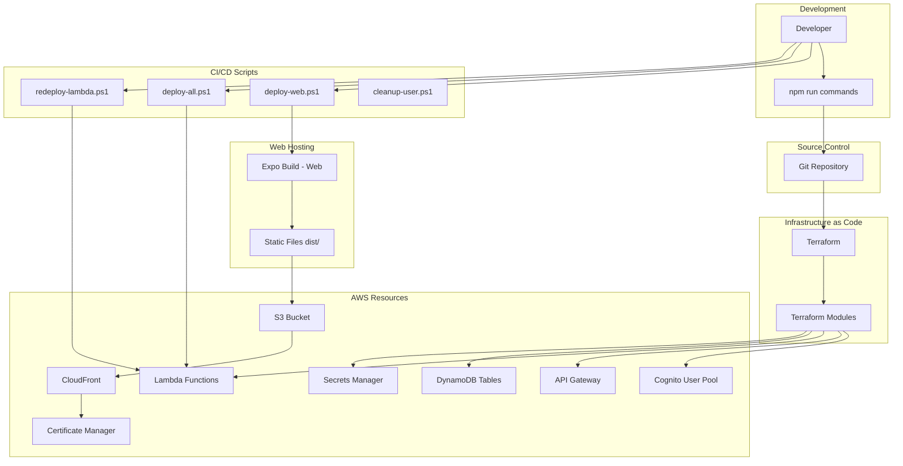
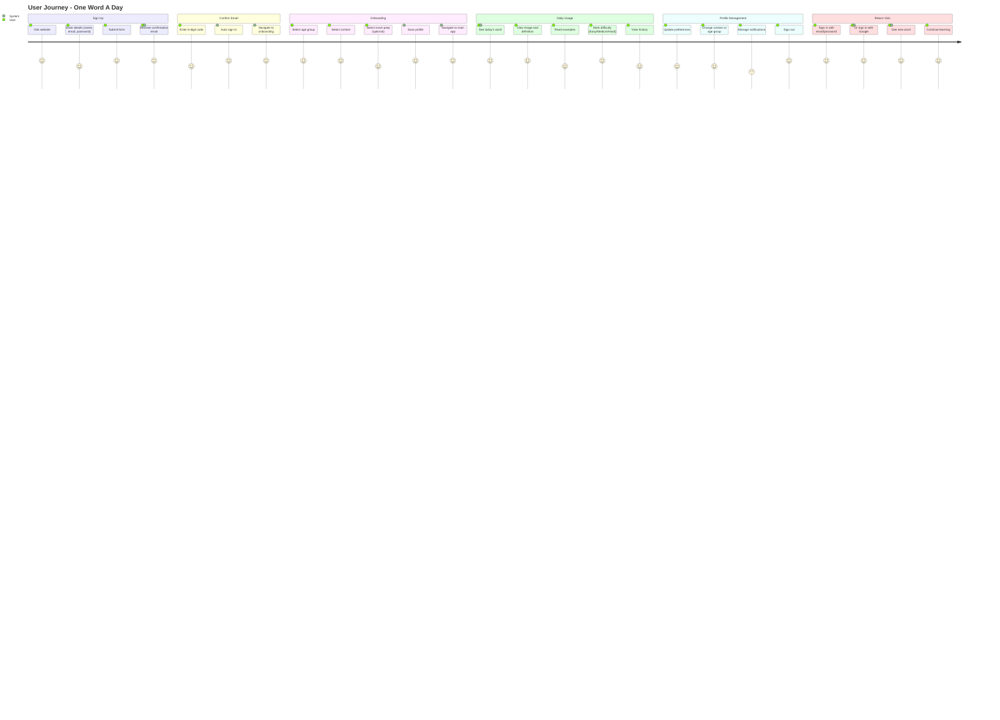

# One Word A Day - Architecture & Process Flow Diagram


## Table of Contents
1. [Complete System Architecture](#complete-system-architecture)
2. [Authentication Flow](#authentication-flow)
3. [User Onboarding Flow](#user-onboarding-flow)
4. [Daily Word Flow](#daily-word-flow)
5. [User Profile Management](#user-profile-management)
6. [Backend Lambda Functions](#backend-lambda-functions)

---

## Complete System Architecture



---

## Authentication Flow



---

## User Onboarding Flow



---

## Daily Word Flow (With Points & Membership)



---

## User Profile Management

```mermaid
flowchart TD
    Start([User Opens Profile Screen]) --> LoadProfile[Load Profile]
    
    LoadProfile --> GetAuthUser[Get Auth User from Context]
    GetAuthUser --> APICall["GET /user/profile with JWT"]
    
    APICall --> Lambda[user-preferences Lambda]
    Lambda --> ExtractClaims[Extract Cognito Claims<br/>userId, email, name]
    
    ExtractClaims --> CheckFields{Name fields available?}
    CheckFields -->|Try all fields| Fields[name, given_name, cognito:username,<br/>preferred_username, username, nickname]
    Fields --> Found{Found name?}
    Found -->|No| ExtractEmail[Extract from email<br/>name = email.split('@')[0]]
    Found -->|Yes| UseName[Use found name]
    ExtractEmail --> UseName
    
    UseName --> QueryDB[Query DynamoDB for user]
    QueryDB --> Exists{Profile exists?}
    
    Exists -->|No| CreateDefault[Create Default Profile<br/>userId, email, name, username,<br/>ageGroup: 'adult', context: 'general']
    CreateDefault --> SaveDB[Save to DynamoDB]
    SaveDB --> ReturnNew[Return new profile]
    
    Exists -->|Yes| MergeCognito[Merge with Cognito data<br/>Prioritize: Cognito > DB > Email > Default]
    MergeCognito --> UpdateMissing{Email or name missing?}
    UpdateMissing -->|Yes| UpdateDB[Update profile in DB]
    UpdateMissing -->|No| ReturnExisting[Return existing profile]
    UpdateDB --> ReturnExisting
    
    ReturnNew & ReturnExisting --> DisplayProfile[Display on Profile Screen]
    
    DisplayProfile --> UserEdit[User Edits Profile]
    UserEdit --> UpdateAPI["PUT /user/profile"]
    UpdateAPI --> UpdateLambda[user-preferences Lambda]
    UpdateLambda --> ValidateData[Validate & merge data<br/>Cognito claims > Body > Existing]
    ValidateData --> SaveUpdate[Save updated profile]
    SaveUpdate --> Success([Profile Updated])

    subgraph "Profile Data Structure"
        PD[Profile Object]
        PD --> PD1[userId: UUID]
        PD --> PD2[email: string]
        PD --> PD3[name: string display name]
        PD --> PD4[username: same as name NOT userId]
        PD --> PD5[ageGroup: enum]
        PD --> PD6[context: enum]
        PD --> PD7[examPrep: string/null]
        PD --> PD8[notificationPreferences: object]
        PD --> PD9[contactInfo: object]
        PD --> PD10[learningPatterns: object]
    end
```

---

## Backend Lambda Functions

### Lambda Function Map



### User Preferences Lambda (Detailed)



---

## Key Data Structures

### User Profile Structure
```json
{
  "userId": "uuid-v4-string",
  "email": "user@example.com",
  "name": "Display Name",
  "username": "Display Name (NOT userId)",
  "ageGroup": "adult|teen|young_adult|child|senior",
  "context": "school|college|corporate|business|exam_prep|general",
  "examPrep": "gre|sat|toefl|ielts|act|null",
  "notificationPreferences": {
    "dailyWord": {
      "enabled": true,
      "channels": ["push"],
      "time": "08:00",
      "timezone": "UTC"
    },
    "feedbackReminder": {
      "enabled": true,
      "time": "20:00"
    },
    "milestones": {
      "enabled": true
    }
  },
  "contactInfo": {
    "expoPushToken": "string|null",
    "phoneNumber": "string|null"
  },
  "timezone": "UTC",
  "language": "en",
  "learningPatterns": {
    "totalWords": 0,
    "practicedWords": 0,
    "averageRating": 0,
    "difficultyPreference": "medium",
    "lastFeedbackDate": "ISO-8601"
  },
  "createdAt": "ISO-8601",
  "updatedAt": "ISO-8601",
  "lastLoginAt": "ISO-8601"
}
```

### Word Structure
```json
{
  "userId": "uuid-v4-string",
  "wordId": "word-YYYY-MM-DD",
  "date": "YYYY-MM-DD",
  "word": "vocabulary",
  "definition": "string",
  "partOfSpeech": "noun|verb|adjective|...",
  "examples": ["example1", "example2", "example3"],
  "pronunciation": "string",
  "synonyms": ["word1", "word2"],
  "antonyms": ["word1", "word2"],
  "imageUrl": "https://...",
  "difficulty": "easy|medium|hard",
  "practiceStatus": "not_started|practicing|mastered",
  "practiceCount": 0,
  "lastPracticedAt": "ISO-8601|null",
  "createdAt": "ISO-8601"
}
```

---

## Frontend File Structure

```
app/
├── (auth)/                    # Authentication screens
│   ├── signin.tsx            # Sign in page
│   ├── signup.tsx            # Sign up page (name, email, password only)
│   ├── confirm.tsx           # Email confirmation with auto-signin
│   └── onboarding.tsx        # 3-step onboarding (age, context, exam)
│
├── (tabs)/                    # Main app tabs
│   ├── _layout.tsx           # Tab navigator
│   ├── index.tsx             # Today's word screen
│   ├── profile.tsx           # User profile management
│   ├── history.tsx           # Word history
│   └── feedback.tsx          # Submit feedback
│
contexts/
├── AuthContext.tsx           # Authentication state & functions
└── ToastContext.tsx          # Toast notifications

lib/
├── auth.ts                   # Auth functions (signUp, signIn, signOut, etc.)
├── api.ts                    # API client (axios)
└── aws-config.ts             # AWS Amplify configuration
```

---

## Deployment Architecture



---

## Complete User Journey



---

## Summary

### Key Components:
1. **Frontend**: Expo React Native (Web + Mobile)
2. **Authentication**: AWS Cognito (Email + Google OAuth)
3. **API**: AWS API Gateway (REST)
4. **Backend**: AWS Lambda (Node.js)
5. **Database**: DynamoDB
6. **AI**: Groq API
7. **Images**: Unsplash API
8. **Hosting**: S3 + CloudFront
9. **IaC**: Terraform

### Critical Flows:
1. **Signup → Confirm → Onboarding → Main App**
2. **Sign In → Main App (skip onboarding if profile exists)**
3. **Today Screen → Lambda → AI/DB → Display Word**
4. **Profile Management → Lambda → DynamoDB → Update**

### Data Priority:
**Username/Name handling:**
- **Cognito Claims** (highest priority)
- **Request Body** (from user input)
- **Existing DB Data**
- **Email Prefix** (fallback)
- **"User"** (final fallback)

**IMPORTANT**: `username` field always equals `name` (display name), NEVER equals `userId` (UUID)

