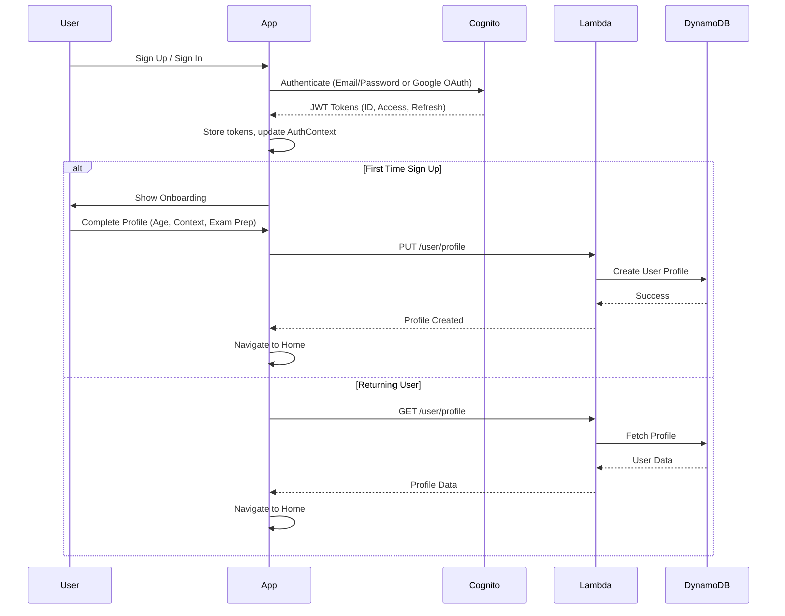
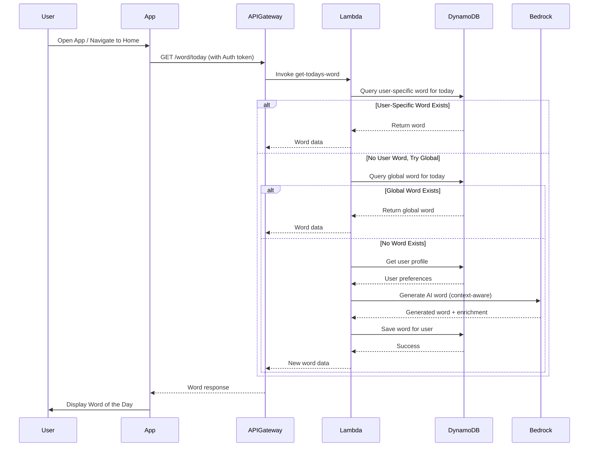
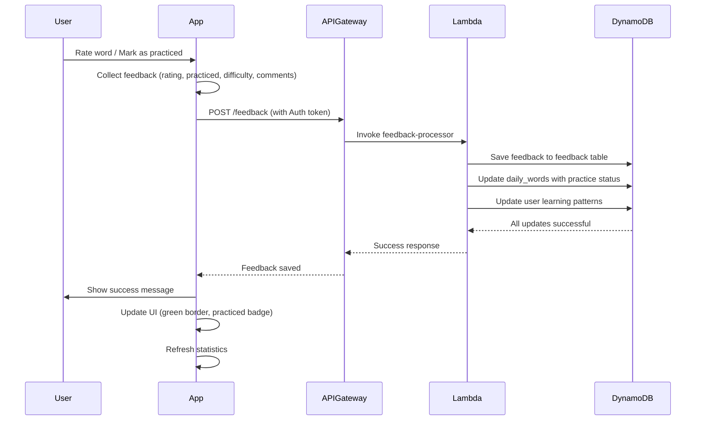
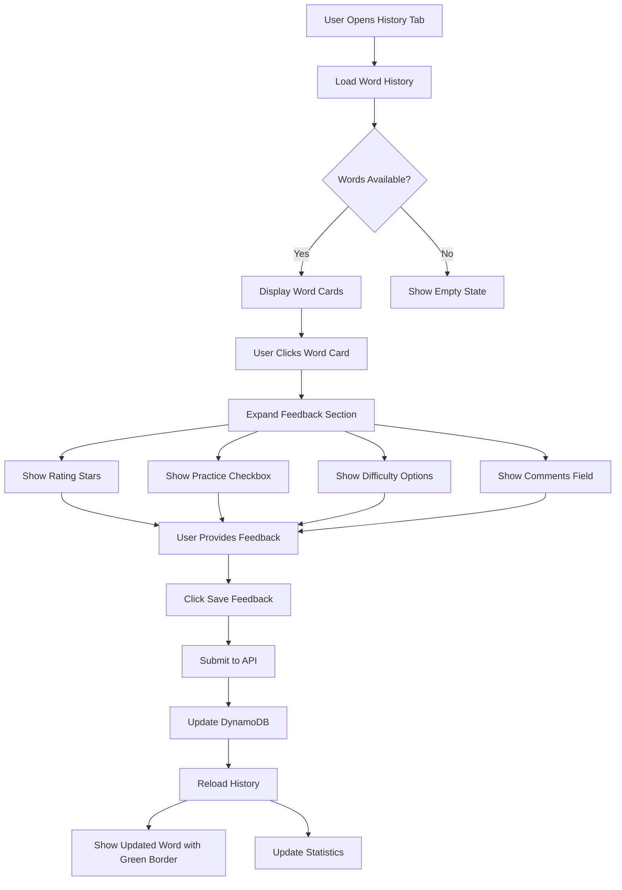
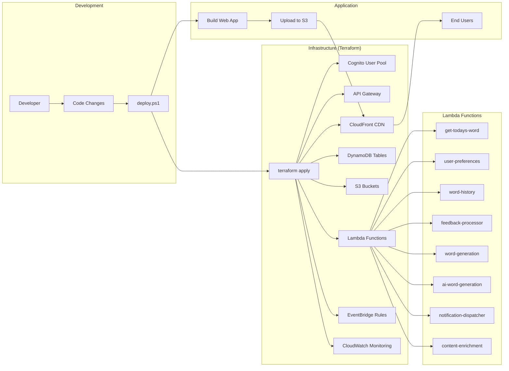
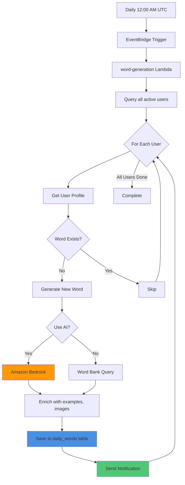

# One Word A Day 📚

> *Master one word at a time, build vocabulary for life*

A personalized vocabulary learning application that delivers context-aware daily words with intelligent practice reinforcement, powered by AWS serverless architecture and AI.

---

## 🎯 Value Proposition

### Why One Word A Day?

**The Problem:**
- Traditional vocabulary apps overwhelm users with too many words
- Generic word lists don't match individual learning contexts
- Lack of personalization leads to poor retention
- No real-world practice reinforcement

**Our Solution:**
One Word A Day takes a focused, personalized approach to vocabulary building:

✨ **One Word Daily** - Manageable, sustainable learning  
🎯 **Context-Aware** - Words tailored to your life (school, corporate, exam prep)  
🧠 **AI-Powered** - Intelligent word selection based on your profile  
📊 **Practice Tracking** - Monitor and reinforce your learning  
🔔 **Smart Reminders** - Multi-channel notifications when you need them  
📱 **Cross-Platform** - Web and mobile apps with seamless sync

### Who Is This For?

- 🎓 **Students** preparing for GRE, SAT, TOEFL, IELTS
- 💼 **Professionals** building corporate communication skills
- 📚 **Lifelong Learners** expanding general vocabulary
- 🌍 **ESL Learners** mastering English in context
- 👨‍🎓 **Educators** tracking student progress

### Key Benefits

| Feature | Benefit |
|---------|---------|
| **Personalized Learning** | Words match your age, context, and goals |
| **AI-Powered Selection** | Smart algorithm chooses optimal words |
| **Practice Reinforcement** | Track what you've learned and used |
| **Multi-Platform** | Learn on web or mobile, data syncs automatically |
| **Progress Insights** | Visualize your vocabulary growth over time |
| **Flexible Feedback** | Rate and review words inline in history |
| **Google Sign-In** | Quick OAuth authentication |

---

## 🏗️ Tech Stack

### Frontend Architecture

```
┌─────────────────────────────────────────────┐
│         React Native + Expo                 │
├─────────────────────────────────────────────┤
│  - TypeScript (Type Safety)                 │
│  - Expo Router (File-based Routing)         │
│  - AWS Amplify (Authentication)             │
│  - Axios (HTTP Client)                      │
│  - Expo Notifications (Push Notifications)  │
│  - Expo Speech (Text-to-Speech)             │
└─────────────────────────────────────────────┘
```

**Technologies:**
- **React Native** - Cross-platform mobile framework
- **Expo** - Development platform and tooling
- **TypeScript** - Static type checking
- **Expo Router** - File-based navigation
- **AWS Amplify JS** - Cognito authentication library
- **Axios** - Promise-based HTTP client
- **Expo Speech** - Text-to-speech for pronunciation
- **Expo Notifications** - Push notification handling

### Backend Architecture

```
┌────────────────────────────────────────────────┐
│           AWS Serverless Stack                 │
├────────────────────────────────────────────────┤
│  Authentication:  AWS Cognito                  │
│  API Gateway:     REST API with Cognito Auth   │
│  Compute:         AWS Lambda (Node.js 18)      │
│  Database:        DynamoDB                     │
│  Storage:         S3 + CloudFront CDN          │
│  AI/ML:           Amazon Bedrock (Claude)      │
│  Notifications:   SNS + SES                    │
│  Scheduling:      EventBridge                  │
│  Monitoring:      CloudWatch                   │
│  Secrets:         Secrets Manager              │
└────────────────────────────────────────────────┘
```

**AWS Services:**
- **Cognito** - User authentication, user pools, federated identities
- **API Gateway** - RESTful API with Cognito authorizer
- **Lambda** - 8 serverless functions (Node.js 18 with ES6 modules)
- **DynamoDB** - 6 NoSQL tables for users, words, feedback
- **S3** - Image and audio file storage
- **CloudFront** - CDN for web app and media delivery
- **Amazon Bedrock** - AI-powered word generation and enrichment
- **SNS** - Push and SMS notifications
- **SES** - Email notifications
- **EventBridge** - Daily word generation scheduler
- **CloudWatch** - Logging, metrics, alarms, dashboard
- **Secrets Manager** - API key storage

### Infrastructure as Code

- **Terraform** - Complete AWS infrastructure deployment
- **Modular Architecture** - 9 reusable Terraform modules
- **PowerShell Scripts** - Automated deployment workflows
- **State Management** - Remote state with locking

---

## 📊 Process Flow Diagrams

### User Authentication Flow



### Daily Word Flow



### Feedback and Practice Tracking



### Inline History Feedback



### Deployment Architecture



---

## 🚀 Quick Start

### Prerequisites

- **Node.js** v18+ ([Download](https://nodejs.org/))
- **AWS CLI** configured ([Setup Guide](https://docs.aws.amazon.com/cli/latest/userguide/cli-chap-configure.html))
- **Terraform** v1.0+ ([Download](https://www.terraform.io/))
- **PowerShell** 7+ (Windows) or bash (Linux/Mac)
- **Git** for version control

### Installation

```bash
# 1. Clone the repository
git clone <your-repo-url>
cd onewordadayapp

# 2. Install dependencies
npm install

# 3. Install backend dependencies
cd backend && npm install && cd ..
```

### Configuration

```bash
# 1. Create Terraform variables file
cd terraform
cp terraform.tfvars.example terraform.tfvars

# 2. Edit terraform.tfvars with your values:
# - AWS region
# - Project name
# - Google OAuth credentials (optional)
# - SES sender email
```

### Deployment

#### Option 1: Full Deployment (First Time)
```powershell
# Deploy everything: infrastructure + backend + frontend
.\scripts\deploy.ps1 -Action full
```

#### Option 2: Individual Components
```powershell
# Deploy only infrastructure (Terraform)
.\scripts\deploy.ps1 -Action infra

# Deploy only Lambda functions
.\scripts\deploy.ps1 -Action lambda

# Deploy only web app
.\scripts\deploy.ps1 -Action web

# Quick redeploy (Lambda + Web)
.\scripts\deploy.ps1 -Action quick
```

### Post-Deployment

```powershell
# Get your app URLs
.\scripts\deploy.ps1 -Action urls

# Check deployment status
.\scripts\deploy.ps1 -Action status

# View Lambda logs
.\scripts\deploy.ps1 -Action logs -Function "get-todays-word"
```

### Start Development Server

```bash
# Web
npx expo start --web

# Mobile
npx expo start
# Scan QR code with Expo Go app
```

---

## 📱 Application Features

### 1. Authentication
- ✅ Email/Password sign up and sign in
- ✅ Google OAuth integration
- ✅ Email verification with confirmation codes
- ✅ Auto sign-in after confirmation
- ✅ Secure token management
- ✅ Session persistence

### 2. Personalized Onboarding
- ✅ Age group selection (6-12, 13-17, 18-25, 26-45, 45+)
- ✅ Learning context (School, College, Corporate, Business, Exam Prep, Daily Life)
- ✅ Optional exam preparation (GRE, SAT, TOEFL, IELTS, ACT, or None)
- ✅ Notification preferences
- ✅ Profile creation with Cognito attributes

### 3. Daily Word Learning
- ✅ Personalized word selection based on profile
- ✅ AI-generated words with Amazon Bedrock
- ✅ Fallback to curated word bank
- ✅ Word details: definition, pronunciation, synonyms, antonyms
- ✅ Example sentences in context
- ✅ Text-to-speech pronunciation
- ✅ Skip to next word functionality

### 4. Enhanced History Section
- ✅ View all words (practiced, viewed, skipped)
- ✅ Filter buttons: All / Practiced / Viewed / Skipped
- ✅ Color-coded cards (green for practiced, red for skipped)
- ✅ Inline feedback on each word
- ✅ Expandable word cards
- ✅ Star ratings (1-5)
- ✅ Practice and encountered tracking
- ✅ Difficulty feedback
- ✅ Personal notes/comments
- ✅ Search functionality
- ✅ Statistics summary

### 5. User Profile Management
- ✅ View and edit profile information
- ✅ Update learning preferences
- ✅ Notification settings
- ✅ Display name from Cognito attributes
- ✅ Account management

### 6. Feedback System
- ✅ Inline feedback in history (NEW!)
- ✅ Star rating (1-5 stars)
- ✅ Practice toggle
- ✅ Encountered in real life toggle
- ✅ Difficulty level selection
- ✅ Comments and notes
- ✅ Instant updates without page reload

---

## 🏛️ System Architecture

### High-Level Architecture

```
┌──────────────────────────────────────────────────────────────┐
│                    CLIENT APPLICATIONS                        │
│  ┌──────────────────┐       ┌──────────────────┐            │
│  │   Web Browser    │       │   Mobile App     │            │
│  │   (React/Expo)   │       │  (React Native)  │            │
│  └────────┬─────────┘       └────────┬─────────┘            │
└───────────┼──────────────────────────┼───────────────────────┘
            │                          │
            ├──────────────────────────┘
            │ HTTPS/TLS
            ▼
┌──────────────────────────────────────────────────────────────┐
│                    AWS CLOUD SERVICES                         │
│                                                               │
│  ┌─────────────────────────────────────────────────────┐    │
│  │              CloudFront CDN                         │    │
│  │  (Web App Hosting + Media Delivery)                 │    │
│  └────────┬────────────────────────────────────────────┘    │
│           │                                                   │
│  ┌────────▼──────────┐      ┌───────────────────────┐      │
│  │    S3 Buckets     │      │   Cognito User Pool   │      │
│  │  - Web App        │      │  - Authentication     │      │
│  │  - Images         │      │  - Google OAuth       │      │
│  │  - Audio Files    │      │  - JWT Tokens         │      │
│  └───────────────────┘      └──────────┬────────────┘      │
│                                         │                     │
│  ┌──────────────────────────────────────▼──────────────┐    │
│  │              API Gateway (REST)                      │    │
│  │  - /user/profile (GET, PUT)                         │    │
│  │  - /word/today (GET)                                │    │
│  │  - /word/history (GET)                              │    │
│  │  - /feedback (POST)                                 │    │
│  │  - Cognito Authorizer on all endpoints             │    │
│  └────────┬─────────────────────────────────────────────┘    │
│           │                                                   │
│  ┌────────▼──────────────────────────────────────────┐      │
│  │           Lambda Functions Layer                   │      │
│  │  ┌──────────────┐  ┌──────────────────────────┐   │      │
│  │  │get-todays-   │  │  user-preferences        │   │      │
│  │  │word          │  │  (GET/PUT profile)       │   │      │
│  │  └──────┬───────┘  └──────┬───────────────────┘   │      │
│  │  ┌──────▼───────┐  ┌──────▼───────────────────┐   │      │
│  │  │word-history  │  │  feedback-processor      │   │      │
│  │  │              │  │                          │   │      │
│  │  └──────────────┘  └──────────────────────────┘   │      │
│  │  ┌──────────────────────────────────────────┐     │      │
│  │  │  word-generation (EventBridge trigger)   │     │      │
│  │  └──────┬───────────────────────────────────┘     │      │
│  │  ┌──────▼─────────────────────────────────┐       │      │
│  │  │  ai-word-generation (Bedrock)          │       │      │
│  │  └────────────────────────────────────────┘       │      │
│  └────────┬──────────────────────────────────────────┘      │
│           │                                                   │
│  ┌────────▼──────────────────────────────────────────┐      │
│  │              DynamoDB Tables                       │      │
│  │  - users (user profiles)                          │      │
│  │  - daily_words (user's daily words)               │      │
│  │  - word_bank (curated vocabulary)                 │      │
│  │  - feedback (user feedback data)                  │      │
│  │  - notification_logs (delivery tracking)          │      │
│  │  - ai_usage (AI generation metrics)               │      │
│  └───────────────────────────────────────────────────┘      │
│                                                               │
│  ┌──────────────────────────────────────────────────────┐   │
│  │         CloudWatch Monitoring                         │   │
│  │  - Logs (all Lambda functions)                       │   │
│  │  - Metrics (API calls, errors, latency)              │   │
│  │  - Alarms (5xx errors, Lambda failures)              │   │
│  │  - Dashboard (system health overview)                │   │
│  └──────────────────────────────────────────────────────┘   │
└──────────────────────────────────────────────────────────────┘
```

### Data Flow: Word Generation to Practice



---

## 📂 Project Structure

```
onewordadayapp/
├── 📱 Frontend (React Native + Expo)
│   ├── app/
│   │   ├── (auth)/
│   │   │   ├── signin.tsx          # Sign in screen
│   │   │   ├── signup.tsx          # Sign up screen
│   │   │   ├── confirm.tsx         # Email confirmation
│   │   │   └── onboarding.tsx      # User onboarding (3 steps)
│   │   ├── (tabs)/
│   │   │   ├── index.tsx           # Today's word screen
│   │   │   ├── history.tsx         # Word history with inline feedback
│   │   │   └── profile.tsx         # User profile management
│   │   ├── _layout.tsx             # Root layout
│   │   └── feedback.tsx            # Dedicated feedback screen
│   ├── contexts/
│   │   ├── AuthContext.tsx         # Authentication state
│   │   └── ToastContext.tsx        # Toast notifications
│   ├── lib/
│   │   ├── auth.ts                 # Auth functions (Amplify)
│   │   ├── api.ts                  # API client (Axios)
│   │   └── aws-config.ts           # AWS configuration
│   └── components/                 # Reusable UI components
│
├── 🔧 Backend (Lambda Functions)
│   └── src/
│       ├── get-todays-word/        # Fetch daily word
│       ├── user-preferences/       # User profile CRUD
│       ├── word-history/           # Historical words query
│       ├── feedback-processor/     # Process user feedback
│       ├── word-generation/        # Daily word generation
│       ├── ai-word-generation/     # Bedrock AI integration
│       ├── notification-dispatcher/# Multi-channel notifications
│       └── content-enrichment/     # Enhance words with media
│
├── 🏗️ Infrastructure (Terraform)
│   ├── main.tf                     # Main configuration
│   ├── variables.tf                # Input variables
│   ├── outputs.tf                  # Output values
│   ├── terraform.tfvars.example    # Template
│   └── modules/
│       ├── cognito/                # User authentication
│       ├── dynamodb/               # Database tables
│       ├── lambda/                 # Serverless functions
│       ├── api-gateway/            # REST API
│       ├── s3/                     # Object storage
│       ├── web-hosting/            # CloudFront + S3
│       ├── sns/                    # Notifications
│       ├── eventbridge/            # Scheduling
│       └── cloudwatch/             # Monitoring
│
├── 📜 Scripts (Deployment Automation)
│   ├── deploy.ps1                  # Unified deployment script
│   └── README.md                   # Script documentation
│
└── 📚 Documentation
    ├── README.md                   # This file
    ├── ARCHITECTURE_FLOW_DIAGRAM.md
    ├── BACKEND_ERROR_HANDLING_IMPROVEMENTS.md
    ├── GOOGLE_OAUTH_SETUP.md
    ├── HISTORY_FEATURE_ENHANCEMENT.md
    ├── TERRAFORM_FIXES_SUMMARY.md
    ├── GITIGNORE_GUIDE.md
    └── [20+ other documentation files]
```

---

## 🔄 Recent Changes & Improvements

### Authentication & Onboarding
- ✅ Auto sign-in after email confirmation
- ✅ Robust error handling for "User does not exist" edge case
- ✅ Graceful fallback when user attributes aren't immediately available
- ✅ Password passed through confirmation flow for auto sign-in
- ✅ Display name correctly loaded from Cognito attributes
- ✅ Exam prep now includes "None" option
- ✅ Consolidated age group and context input to onboarding only

### Backend Improvements
- ✅ Comprehensive step-by-step logging in all Lambda functions
- ✅ Fixed undefined property access errors
- ✅ Added fallback to global words
- ✅ Environment-specific error responses (no stack traces in production)
- ✅ Proper HTTP status codes (400, 403, 404, 500)
- ✅ ES6 module support with package.json
- ✅ Restored environment variables and API Gateway permissions
- ✅ Enhanced error categorization

### User Experience
- ✅ Inline feedback in history section (no separate screen needed)
- ✅ Filter buttons: All / Practiced / Viewed / Skipped
- ✅ Color-coded word cards (green for practiced, red for skipped)
- ✅ Expandable feedback sections
- ✅ Instant UI updates after feedback submission
- ✅ Enhanced statistics tracking
- ✅ Better empty states with contextual messages
- ✅ Toast notifications for web platform
- ✅ Platform-specific handling (web vs mobile)

### Google OAuth
- ✅ Cognito User Pool domain created
- ✅ Google Identity Provider configured
- ✅ OAuth flows enabled (authorization code, implicit)
- ✅ Callback URLs properly configured
- ✅ Hosted UI accessible
- ✅ Domain: `onewordaday-production.auth.us-east-1.amazoncognito.com`

### Infrastructure & Deployment
- ✅ Unified deployment script (`deploy.ps1`)
- ✅ Terraform configuration fixes (SSL certificate, OAuth URLs)
- ✅ API Gateway permissions restored
- ✅ Lambda environment variables properly set
- ✅ CloudFront using default certificate (custom domain ready)
- ✅ Consolidated PowerShell scripts
- ✅ Enhanced .gitignore configuration
- ✅ Comprehensive documentation (25+ guides)

---

## 🛠️ Technology Deep Dive

### Frontend Stack

| Technology | Purpose | Why We Use It |
|------------|---------|---------------|
| **React Native** | Mobile framework | Cross-platform (iOS + Android) with single codebase |
| **Expo** | Development platform | Faster development, OTA updates, managed workflow |
| **TypeScript** | Language | Type safety, better IDE support, fewer runtime errors |
| **Expo Router** | Navigation | File-based routing, type-safe navigation |
| **AWS Amplify** | Auth library | Seamless Cognito integration, token management |
| **Axios** | HTTP client | Promise-based, interceptors, better error handling |
| **Context API** | State management | Built-in React, perfect for auth and global state |

### Backend Stack

| Technology | Purpose | Why We Use It |
|------------|---------|---------------|
| **AWS Lambda** | Serverless compute | No server management, pay per use, auto-scaling |
| **Node.js 18** | Runtime | Modern JavaScript, ES6 modules, great ecosystem |
| **DynamoDB** | NoSQL database | Serverless, fast, flexible schema, pay per request |
| **API Gateway** | REST API | Managed API, built-in auth, rate limiting |
| **Cognito** | Authentication | Managed user pools, OAuth, secure token handling |
| **Amazon Bedrock** | AI generation | Claude AI, context-aware word selection |
| **CloudWatch** | Monitoring | Centralized logs, metrics, alarms, dashboards |
| **EventBridge** | Scheduling | Cron-based triggers, reliable daily execution |

### Infrastructure Stack

| Technology | Purpose | Why We Use It |
|------------|---------|---------------|
| **Terraform** | IaC tool | Version-controlled infrastructure, reproducible |
| **PowerShell** | Automation | Windows-native, robust scripting, AWS CLI integration |
| **Git** | Version control | Track changes, collaboration, rollback capability |
| **CloudFront** | CDN | Global distribution, HTTPS, caching, performance |
| **S3** | Object storage | Reliable, cheap, unlimited storage |

---

## 📋 API Reference

### Base URL
```
https://48jp6br6h2.execute-api.us-east-1.amazonaws.com/production
```

### Endpoints

#### 1. Get User Profile
```http
GET /user/profile
Authorization: Bearer {id_token}
```

**Response:**
```json
{
  "message": "User profile retrieved",
  "profile": {
    "userId": "user-uuid",
    "email": "user@example.com",
    "name": "User Name",
    "ageGroup": "adult",
    "context": "corporate",
    "examPrep": null,
    "notificationPreferences": {...}
  }
}
```

#### 2. Update User Profile
```http
PUT /user/profile
Authorization: Bearer {id_token}
Content-Type: application/json

{
  "ageGroup": "adult",
  "context": "corporate",
  "examPrep": "gre"
}
```

#### 3. Get Today's Word
```http
GET /word/today
Authorization: Bearer {id_token}
```

**Response:**
```json
{
  "message": "Word retrieved successfully",
  "word": {
    "wordId": "eloquent-001",
    "word": "eloquent",
    "definition": "Fluent or persuasive in speaking or writing",
    "partOfSpeech": "adjective",
    "pronunciation": "EL-uh-kwent",
    "sentences": [...],
    "synonyms": [...],
    "antonyms": [...],
    "difficulty": "medium",
    "date": "2025-11-12"
  }
}
```

#### 4. Get Word History
```http
GET /word/history?limit=100
Authorization: Bearer {id_token}
```

#### 5. Submit Feedback
```http
POST /feedback
Authorization: Bearer {id_token}
Content-Type: application/json

{
  "wordId": "eloquent-001",
  "date": "2025-11-12",
  "rating": 5,
  "practiced": true,
  "encountered": false,
  "difficulty": "appropriate",
  "comments": "Used in my presentation"
}
```

---

## 🚀 Deployment Guide

### Using the Unified Script

The `deploy.ps1` script handles all deployment scenarios:

```powershell
# See all available actions
.\scripts\deploy.ps1 -Action help

# Full deployment (recommended for first time)
.\scripts\deploy.ps1 -Action full

# Deploy only what changed
.\scripts\deploy.ps1 -Action lambda    # Backend changes
.\scripts\deploy.ps1 -Action web       # Frontend changes
.\scripts\deploy.ps1 -Action quick     # Both Lambda + Web

# Utilities
.\scripts\deploy.ps1 -Action urls      # Get app URLs
.\scripts\deploy.ps1 -Action status    # Check health
.\scripts\deploy.ps1 -Action logs -Function "get-todays-word"
```

### Manual Deployment Steps

<details>
<summary>Click to expand manual deployment instructions</summary>

#### 1. Deploy Infrastructure
```bash
cd terraform
terraform init
terraform plan
terraform apply
```

#### 2. Deploy Lambda Functions
```bash
cd backend/src/get-todays-word
Compress-Archive -Path * -DestinationPath function.zip -Force
aws lambda update-function-code --function-name onewordaday-production-get-todays-word --zip-file fileb://function.zip
Remove-Item function.zip
```

#### 3. Build and Deploy Web App
```bash
# Build
npx expo export --platform web

# Upload to S3
aws s3 sync dist/ s3://onewordaday-web-production/ --delete

# Invalidate CloudFront cache
aws cloudfront create-invalidation --distribution-id E3PDUUZ5PMF7GL --paths "/*"
```

</details>

---

## 📊 Database Schema

### DynamoDB Tables

#### users
```
Partition Key: userId (String)
Attributes:
- email, name, username
- ageGroup, context, examPrep
- notificationPreferences
- learningPatterns
- createdAt, updatedAt
```

#### daily_words
```
Partition Key: userId (String)
Sort Key: date (String, YYYY-MM-DD)
Attributes:
- wordId, word, definition
- partOfSpeech, pronunciation
- sentences[], synonyms[], antonyms[]
- difficulty, practiceStatus
- rating, practiced, encountered
- comments
GSI: DateIndex (for global words)
```

#### word_bank
```
Partition Key: wordId (String)
Attributes:
- word, definition, partOfSpeech
- difficulty, category, tags[]
- frequency, priority
```

#### feedback
```
Partition Key: userId (String)
Sort Key: timestamp (String)
Attributes:
- wordId, date
- rating, practiced, encountered
- difficulty, comments
```

---

## 🧪 Testing

### Local Testing

```bash
# Start web app locally
npx expo start --web

# Start mobile app
npx expo start
```

### Lambda Testing

```powershell
# Test specific Lambda function
.\scripts\deploy.ps1 -Action logs -Function "user-preferences"

# Check recent errors
aws logs filter-log-events --log-group-name /aws/lambda/onewordaday-production-get-todays-word --filter-pattern "ERROR"
```

### End-to-End Testing Checklist

- [ ] Sign up new user
- [ ] Confirm email with code
- [ ] Complete onboarding (age, context, exam prep)
- [ ] View today's word
- [ ] Provide feedback on word
- [ ] Navigate to history
- [ ] Filter history (practiced/viewed/skipped)
- [ ] Expand word and add inline feedback
- [ ] View and edit profile
- [ ] Test Google sign-in
- [ ] Test sign out

---

## 🔧 Maintenance

### Update Lambda Function

```powershell
# Quick update via script
.\scripts\deploy.ps1 -Action lambda

# Manual update
cd backend/src/FUNCTION_NAME
Compress-Archive -Path * -DestinationPath function.zip -Force
aws lambda update-function-code --function-name onewordaday-production-FUNCTION_NAME --zip-file fileb://function.zip
Remove-Item function.zip
```

### Add New Word to Database

```powershell
# Create word JSON file
aws dynamodb put-item --table-name onewordaday-production-daily-words --item file://word.json
```

### Clean Up Test User

```powershell
.\scripts\deploy.ps1 -Action cleanup-user -Email "test@example.com"
```

### View Logs

```powershell
# Real-time logs
.\scripts\deploy.ps1 -Action logs -Function "get-todays-word"

# Recent errors only
aws logs tail /aws/lambda/onewordaday-production-get-todays-word --since 5m --filter-pattern "ERROR"
```

---

## 💰 Cost Analysis

### Estimated Monthly Costs

| Service | Light (100 users) | Medium (1K users) | Heavy (10K users) |
|---------|-------------------|-------------------|-------------------|
| **Lambda** | $1-2 | $5-10 | $30-50 |
| **DynamoDB** | $1-2 | $5-10 | $25-40 |
| **API Gateway** | $0.50-1 | $3-5 | $15-25 |
| **S3 + CloudFront** | $0.50-1 | $2-5 | $10-20 |
| **SNS (Push)** | $0-1 | $1-3 | $5-10 |
| **Cognito** | Free | Free (up to 50K MAU) | $0.0055/MAU |
| **CloudWatch** | $0.50 | $1-2 | $5-8 |
| **Total** | **$4-8** | **$17-35** | **$90-153** |

**Cost Optimization Tips:**
- Use DynamoDB on-demand pricing for unpredictable traffic
- Implement CloudFront caching to reduce API calls
- Use EventBridge instead of polling for scheduled tasks
- Batch DynamoDB operations where possible
- Set appropriate Lambda memory/timeout limits

---

## 🔒 Security

### Implemented Security Measures

✅ **Authentication:**
- AWS Cognito with JWT tokens
- Password policy (8+ chars, uppercase, lowercase, numbers, symbols)
- Email verification required
- MFA support (optional)
- Google OAuth with proper scopes

✅ **Authorization:**
- Cognito authorizer on all API Gateway endpoints
- User isolation (users can only access their own data)
- IAM roles with least privilege principle

✅ **Data Protection:**
- Encryption at rest (DynamoDB, S3)
- Encryption in transit (HTTPS/TLS)
- Secure credential storage (Secrets Manager)
- No sensitive data in logs or error messages

✅ **API Security:**
- CORS configured properly
- Rate limiting on API Gateway
- Request validation
- Error messages don't expose internal details

✅ **Infrastructure:**
- Terraform state stored securely
- Secrets excluded from version control
- Environment variables for configuration
- Regular dependency updates

### Security Best Practices

1. **Never commit secrets** - Use `.env.example` templates
2. **Rotate credentials regularly** - Update API keys quarterly
3. **Monitor CloudWatch** - Set up alarms for unusual activity
4. **Review IAM permissions** - Audit regularly
5. **Keep dependencies updated** - Run `npm audit` regularly
6. **Use MFA** - Enable on AWS account and Cognito

---

## 📈 Monitoring & Observability

### CloudWatch Dashboard

View real-time metrics:
- API Gateway request count and latency
- Lambda invocations and errors
- DynamoDB read/write capacity
- AI generation success rate

### Alarms Configured

- ⚠️ API 5xx errors (threshold: 5 in 5 minutes)
- ⚠️ Lambda function errors
- ⚠️ AI generation failures
- ⚠️ High API latency (> 2 seconds)
- ⚠️ LLM provider failures

### Log Groups

All Lambda functions log to CloudWatch:
```
/aws/lambda/onewordaday-production-get-todays-word
/aws/lambda/onewordaday-production-user-preferences
/aws/lambda/onewordaday-production-word-history
/aws/lambda/onewordaday-production-feedback-processor
/aws/lambda/onewordaday-production-word-generation
/aws/lambda/onewordaday-production-ai-word-generation
/aws/lambda/onewordaday-production-notification-dispatcher
/aws/lambda/onewordaday-production-content-enrichment
```

---

## 🐛 Troubleshooting

### Common Issues

<details>
<summary>❌ 500 Error on API calls</summary>

**Cause:** Lambda function error or missing environment variables

**Fix:**
```powershell
# Check Lambda logs
.\scripts\deploy.ps1 -Action logs -Function "get-todays-word"

# Verify environment variables
aws lambda get-function-configuration --function-name onewordaday-production-get-todays-word

# Redeploy Lambda
.\scripts\deploy.ps1 -Action lambda
```
</details>

<details>
<summary>❌ 502 Bad Gateway</summary>

**Cause:** Lambda syntax error or timeout

**Fix:**
```powershell
# Check if Lambda has package.json (for ES6 modules)
# Verify Lambda finishes within timeout (60s)
# Check CloudWatch logs for errors
```
</details>

<details>
<summary>❌ DNS Error on Google Sign-In</summary>

**Cause:** Cognito domain not configured

**Fix:**
```powershell
# Verify domain exists
aws cognito-idp describe-user-pool --user-pool-id us-east-1_vyrvuvu36

# Check domain
nslookup onewordaday-production.auth.us-east-1.amazoncognito.com
```

**Status:** ✅ Fixed - Domain now configured
</details>

<details>
<summary>❌ 401 Unauthorized</summary>

**Cause:** Missing or expired auth token

**Fix:**
- Sign out and sign in again
- Check token expiry (1 hour for access token)
- Verify Cognito configuration
```
</details>

<details>
<summary>❌ "User does not exist" after confirmation</summary>

**Cause:** Attempting to fetch attributes too soon after sign-up

**Fix:** ✅ Already handled - `getCurrentAuthUser` now has try-catch for attribute fetching
</details>

### Debug Commands

```powershell
# Check Lambda status
aws lambda get-function --function-name onewordaday-production-get-todays-word

# Test Lambda directly
aws lambda invoke --function-name onewordaday-production-get-todays-word --payload file://test-payload.json response.json

# Check API Gateway integration
aws apigateway get-integration --rest-api-id 48jp6br6h2 --resource-id RESOURCE_ID --http-method GET

# Verify DynamoDB item
aws dynamodb get-item --table-name onewordaday-production-daily-words --key '{"userId":{"S":"GLOBAL"},"date":{"S":"2025-11-12"}}'
```

---

## 📚 Documentation

### Complete Documentation Library

| Document | Description |
|----------|-------------|
| **README.md** | This file - complete overview |
| **ARCHITECTURE_FLOW_DIAGRAM.md** | Detailed system diagrams |
| **BACKEND_ERROR_HANDLING_IMPROVEMENTS.md** | Error handling enhancements |
| **GOOGLE_OAUTH_SETUP.md** | Google OAuth configuration guide |
| **HISTORY_FEATURE_ENHANCEMENT.md** | Inline feedback feature |
| **TERRAFORM_FIXES_SUMMARY.md** | Infrastructure fixes |
| **GITIGNORE_GUIDE.md** | Version control configuration |
| **USER_NAME_DISPLAY_FIX.md** | Username display debugging |
| **DEPLOYMENT_GUIDE.md** | Step-by-step deployment |
| **scripts/README.md** | Deployment script reference |

### Quick Links

- [Architecture Diagrams](./ARCHITECTURE_FLOW_DIAGRAM.md)
- [Google OAuth Setup](./GOOGLE_OAUTH_SETUP.md)
- [Deployment Script Guide](./scripts/README.md)
- [History Feature Guide](./HISTORY_FEATURE_ENHANCEMENT.md)

---

## 🎓 Learning Resources

### AWS Services Used

- [AWS Lambda Documentation](https://docs.aws.amazon.com/lambda/)
- [Amazon DynamoDB Guide](https://docs.aws.amazon.com/dynamodb/)
- [AWS Amplify for React Native](https://docs.amplify.aws/react-native/)
- [Amazon Bedrock](https://docs.aws.amazon.com/bedrock/)

### Frameworks & Tools

- [React Native Docs](https://reactnative.dev/docs/getting-started)
- [Expo Documentation](https://docs.expo.dev/)
- [Terraform AWS Provider](https://registry.terraform.io/providers/hashicorp/aws/)
- [TypeScript Handbook](https://www.typescriptlang.org/docs/)

---

## 🔮 Roadmap

### ✅ Completed (Phase 1)
- User authentication with email and Google OAuth
- Personalized onboarding flow
- Daily word generation with AI
- User profile management
- Word history with filters
- Inline feedback system
- Progress tracking
- Multi-platform support (web + mobile)
- Comprehensive documentation
- Automated deployment scripts

### 🚧 In Progress (Phase 2)
- [ ] SMS and email notifications
- [ ] Audio pronunciation files
- [ ] Word images with AI generation
- [ ] Spaced repetition algorithm
- [ ] Calendar view of learning history

### 📋 Planned (Phase 3)
- [ ] Social features (share words)
- [ ] Learning streaks and achievements
- [ ] Custom word lists
- [ ] Offline mode
- [ ] Word of the week challenges
- [ ] Export learned words
- [ ] Mobile app store submission

### 🌟 Future Ideas (Phase 4)
- [ ] Team/classroom mode
- [ ] Leaderboards
- [ ] Integration with language learning platforms
- [ ] Browser extension
- [ ] API for third-party integrations
- [ ] Premium features (advanced analytics)

---

## 🤝 Contributing

This is currently a personal project, but contributions are welcome!

### How to Contribute

1. Fork the repository
2. Create a feature branch (`git checkout -b feature/amazing-feature`)
3. Make your changes
4. Test thoroughly
5. Commit with descriptive messages
6. Push to your branch
7. Open a Pull Request

### Code Standards

- Use TypeScript for frontend code
- Follow existing code style
- Add comments for complex logic
- Update documentation for new features
- Test on both web and mobile
- Ensure no linter errors

---

## 📄 License

MIT License - See [LICENSE](./LICENSE) file for details.

This project is free to use for:
- Personal learning
- Educational purposes
- Building your own vocabulary app
- Commercial use (attribution appreciated)

---

## 🙏 Acknowledgments

### Built With
- **React Native** & **Expo** - Mobile framework
- **AWS Cloud Services** - Serverless infrastructure
- **Terraform** - Infrastructure as Code
- **Amazon Bedrock** - AI-powered generation
- **TypeScript** - Type-safe development

### Inspired By
- Spaced repetition learning systems
- Modern vocabulary building apps
- Serverless architecture best practices

---

## 📞 Support

### Getting Help

1. **Check Documentation** - 25+ guides available
2. **Review Logs** - CloudWatch has detailed execution traces
3. **Common Issues** - See Troubleshooting section above
4. **Terraform Issues** - See TERRAFORM_FIXES_SUMMARY.md

### Reporting Issues

When reporting issues, please include:
- Error message and stack trace
- Steps to reproduce
- Expected vs actual behavior
- Environment (web/mobile, browser, OS)
- CloudWatch logs (if backend issue)

---

## 🌟 Why This Project Exists

**Mission:** Make vocabulary learning accessible, personalized, and effective for everyone.

**Vision:** Help millions of people expand their vocabulary one word at a time, with AI-powered personalization and proven learning techniques.

**Values:**
- 🎯 **Focus** - One word is better than overwhelming lists
- 🧠 **Intelligence** - AI adapts to each learner
- 📊 **Progress** - Track and celebrate growth
- 🌍 **Accessibility** - Free, open-source, multi-platform
- 💡 **Innovation** - Modern tech for timeless learning

---

## 📊 Success Metrics

### User Engagement
- Daily active users
- Words practiced per user
- Average session duration
- Retention rate (7-day, 30-day)

### Learning Outcomes
- Words mastered (rated 4-5 stars)
- Practice consistency (days with activity)
- Feedback quality (detailed comments)
- Real-world usage (encountered toggle)

### System Health
- API response time (<200ms p95)
- Error rate (<0.1%)
- Lambda cold start time
- DynamoDB read/write capacity

---

## 🚀 Quick Commands Reference

```powershell
# Deploy everything
.\scripts\deploy.ps1 -Action full

# Update after code changes
.\scripts\deploy.ps1 -Action quick

# Check logs
.\scripts\deploy.ps1 -Action logs -Function "get-todays-word"

# Get URLs
.\scripts\deploy.ps1 -Action urls

# Clean up user
.\scripts\deploy.ps1 -Action cleanup-user -Email "user@example.com"

# Start local dev
npx expo start --web

# Build web app
npx expo export --platform web

# View Terraform plan
cd terraform && terraform plan

# Validate certificate
aws acm describe-certificate --certificate-arn ARN
```

---

**Made with ❤️ for vocabulary learners everywhere**

*One word at a time, building knowledge for life* 📚✨
